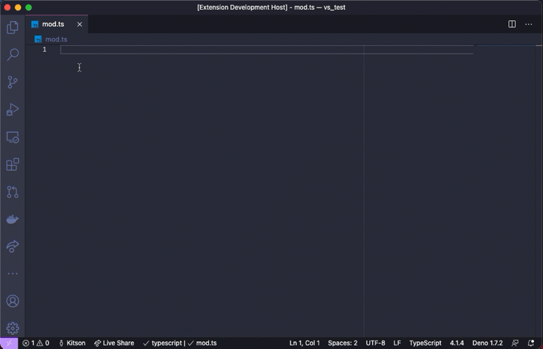

# Deno for Visual Studio Code


This extension adds support for using [Deno](https://deno.land/) with Visual
Studio Code, powered by the Deno language server.

> ⚠️ **Important:** You need to have a version of Deno CLI installed (v1.13.0 or
> later). The extension requires the executable and by default will use the
> environment path. You can explicitly set the path to the executable in Visual
> Studio Code Settings for `deno.path`.
>
> [Check here](https://deno.land/#installation) for instructions on how to
> install the Deno CLI.



## Features

- Type checking for JavaScript and TypeScript, including quick fixes, hover
  cards, intellisense, and more.
- Integrates with the version of the Deno CLI you have installed, ensuring there
  is alignment between your editor and the Deno CLI.
- Resolution of modules in line with Deno CLI's module resolution strategy
  allows caching of remote modules in Deno CLI's cache.
- Integration to Deno CLI's linting functionality, including inline diagnostics
  and hover cards.
- Integration to Deno CLI's formatting functionality.
- Allow specifying of import maps and TypeScript configuration files that are
  used with the Deno CLI.
- [Auto completion for imports](./docs/ImportCompletions.md).
- [Workspace folder configuration](./docs/workspaceFolders.md).
- [Testing Code Lens](./docs/testing.md).
- [Provides Tasks for the Deno CLI](./docs/tasks.md).

## Usage

1. Install the Deno CLI.
2. Install this extension.
3. Ensure `deno` is available in the environment path, or set its path via the
   `deno.path` setting in VSCode.
4. Open the VS Code command palette with `Ctrl+Shift+P`, and run the _Deno:
   Initialize Workspace Configuration_ command.

We recognize that not every TypeScript/JavaScript project that you might work on
in VSCode uses Deno — therefore, by default, this extension will only apply the
Deno language server when the setting `deno.enable` is set to `true`. This can
be done via editing the settings or using the command _Deno: Initialize
Workspace Configuration_.

While you can enable Deno globally, you probably only want to do that if every
JavaScript/TypeScript workspace you work on in VSCode is a Deno based one.

## Commands

The extension provides several commands:

- _Deno: Cache_ - instructs Deno to fetch and cache all the dependencies of the
  current file open in the editor. This is similar to doing `deno cache` on the
  command line. Deno will not automatically fetch and cache remote dependencies.

  > ℹ️ &nbsp; If there are missing dependencies in a module, the extension will
  > provide a quick fix to fetch and cache those dependencies, which invokes
  > this command for you.
- _Deno: Initialize Workspace Configuration_ - will enabled Deno on the current
  workspace and allow you to choose to enable linting and Deno _unstable_ API
  options.
- _Deno: Language Server Status_ - displays a page of information about the
  status of the Deno Language Server. Useful when submitting a bug about the
  extension or the language server. _ _Deno: Reload Import Registries Cache_ -
  reload any cached responses from the configured import registries.
- _Deno: Welcome_ - displays the information document that appears when the
  extension is first installed.

## Formatting

The extension provides formatting capabilities for JavaScript, TypeScript, JSX,
TSX, JSON and markdown documents. When choosing to format a document or setting
up a default formatter for these type of files, the extension should be listed
as an option.

When configuring a formatter, you use the extension name, which in the case of
this extension is `denoland.vscode-deno`. For example, to configure Deno to
format your TypeScript files automatically on saving, you might set your
`settings.json` in the workspace like this:

```json
{
  "deno.enable": true,
  "deno.lint": true,
  "editor.formatOnSave": true,
  "[typescript]": { "editor.defaultFormatter": "denoland.vscode-deno" }
}
```

Or if you wanted to have Deno be your default formatter overall:

```json
{
  "deno.enable": true,
  "editor.formatOnSave": true,
  "editor.defaultFormatter": "denoland.vscode-deno"
}
```

The formatter will respect the settings in your Deno configuration file, which
can be explicitly set via `deno.config` or automatically detected in the
workspace. You can find more information about formatter settings at
[Deno Tools - Formatter](https://deno.land/manual/tools/formatter).

> ℹ️ &nbsp; It does not currently provide format-on-paste or format-on-type
> capabilities.

## Configuration

You can control the settings for this extension through your VS Code settings
page. You can open the settings page using the `Ctrl+,` keyboard shortcut. The
extension has the following configuration options:

- `deno.enable`: Controls if the Deno Language Server is enabled. When enabled,
  the extension will disable the built-in VSCode JavaScript and TypeScript
  language services, and will use the Deno Language Server (`deno lsp`) instead.
  _boolean, default `false`_
- `deno.path`: A path to the `deno` executable. If unset, the extension will use
  the environment path to resolve the `deno` executable. If set, the extension
  will use the supplied path. The path should include the executable name (e.g.
  `/usr/bin/deno`, `C:\Program Files\deno\deno.exe`).
- `deno.cache`: Controls the location of the cache (`DENO_DIR`) for the Deno
  language server. This is similar to setting the `DENO_DIR` environment
  variable on the command line.
- `deno.codeLens.implementations`: Enables or disables the display of code lens
  information for implementations for items in the code. _boolean, default
  `false`_
- `deno.codeLens.references`: Enables or disables the display of code lens
  information for references of items in the code. _boolean, default `false`_
- `deno.codeLens.referencesAllFunctions`: Enables or disables the display of
  code lens information for all functions in the code. Requires
  `deno.codeLens.references` to be enabled as well. _boolean, default `false`_
- `deno.codeLens.test`: Enables or disables the display of test code lens on
  Deno tests. _boolean, default `false`_. _This feature is deprecated, see
  `deno.testing` below_
- `deno.codeLens.testArgs`: Provides additional arguments that should be set
  when invoking the Deno CLI test from a code lens. _array of strings, default
  `[ "--allow-all" ]`_.
- `deno.config`: The file path to a configuration file. This is the equivalent
  to using `--config` on the command line. The path can be either be relative to
  the workspace, or an absolute path. It is recommended you name this file
  either `deno.json` or `deno.jsonc`. _string, default `null`, examples:
  `./deno.jsonc`, `/path/to/deno.jsonc`, `C:\path\to\deno.jsonc`_
- `deno.enablePaths`: Controls if the Deno Language Server is enabled for only
  specific paths of the workspace folder. Defaults to an empty list.
- `deno.importMap`: The file path to an import map. This is the equivalent to
  using `--import-map` on the command line.
  [Import maps](https://deno.land/manual/linking_to_external_code/import_maps)
  provide a way to "relocate" modules based on their specifiers. The path can
  either be relative to the workspace, or an absolute path. _string, default
  `null`, examples: `./import_map.json`, `/path/to/import_map.json`,
  `C:\path\to\import_map.json`_
- `deno.inlayHints.enumMemberValues.enabled` - Enable/disable inlay hints for
  enum values.
- `deno.inlayHints.functionLikeReturnTypes.enabled` - Enable/disable inlay hints
  for implicit function return types.
- `deno.inlayHints.parameterNames.enabled` - Enable/disable inlay hints for
  parameter names. Values can be `"none"`, `"literals"`, `"all"`.
- `deno.inlayHints.parameterNames.suppressWhenArgumentMatchesName` - Do not
  display an inlay hint when the argument name matches the parameter.
- `deno.inlayHints.parameterTypes.enabled` - Enable/disable inlay hints for
  implicit parameter types.
- `deno.inlayHints.propertyDeclarationTypes.enabled` - Enable/disable inlay
  hints for implicit property declarations.
- `deno.inlayHints.variableTypes.enabled` - Enable/disable inlay hints for
  implicit variable types.
- `deno.inlayHints.variableTypes.suppressWhenTypeMatchesName` - Suppress type
  hints where the variable name matches the implicit type.
- `deno.internalDebug`: If enabled the Deno Language Server will log additional
  internal diagnostic information.
- `deno.lint`: Controls if linting information will be provided by the Deno
  Language Server. _boolean, default `true`_
- `deno.suggest.imports.hosts`: A map of domain hosts (origins) that are used
  for suggesting import auto completions. (See:
  [ImportCompletions](./docs/ImportCompletions.md) for more information.)
- `deno.testing.args`: Arguments to use when running tests via the Test
  Explorer. Defaults to `[ \"--allow-all\" ]`.
- `deno.testing.enable`: Enable the testing API for the language server. When
  folder is Deno enabled, tests will be available in the Test Explorer view.
  Defaults to `true`.
- `deno.unstable`: Controls if code will be type checked with Deno's unstable
  APIs. This is the equivalent to using `--unstable` on the command line.
  _boolean, default `false`_

## Contribute

We appreciate your help!

To build the extension locally, clone this repository and run the following
steps:

1. Open this folder in VS Code.
2. Run `npm i`.
3. Run the `Launch Client` launch task from the VSCode debug menu.

After making changes to the extension you can use the restart button in the
VSCode debug menu, this makes a new build and reloads the client.

Note that if you already have the deno extension installed from the VSCode
Marketplace, it will be replaced for the `Launch Client` instance only. So
there's no need to uninstall your existing Deno extension.

Most changes and feature enhancements do not require changes to the extension
though, as most information comes from the Deno Language Server itself, which is
integrated into the Deno CLI. Please check out the
[contribution guidelines](https://deno.land/manual/contributing) for the Deno
CLI.

## Thanks

This project was inspired by
[justjavac/vscode-deno](https://github.com/justjavac/vscode-deno) and
[axetroy/vscode-deno](https://github.com/axetroy/vscode-deno). Thanks for their
contributions.

## License

The [MIT License](LICENSE)
