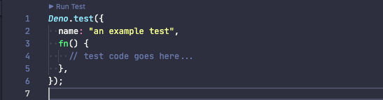

# Testing

## Code Lenses

The extension identifies test cases using the integrated Deno test API and
provides a user interface via the vscode code lens API to allow you to run the
test individually from inside the IDE.

When the extension detects a test in the code, it will display a `▶ Run Test`
code lens above the test:

When this is activated, the extension will spawn the Deno CLI, instructing it to
run just that test.

The code lenses are enabled by default. To disable them, set
`deno.codeLens.test` to `false` in your settings.

Additional arguments, outside of just the module to test and the test filter,
are supplied when executing the Deno CLI. These are configured via
`deno.codeLens.testArgs`. They default to `[ "--allow-all" ]`. In addition, when
executing the test, the extension will reflect the `deno.unstable` setting in
the command line, meaning that if it is `true` then the `--unstable` flag will
be sent as an argument to the test command.
