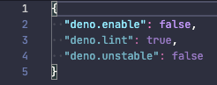

# Workspace Folders

The Deno language server and this extension supports
[multi-root workspaces](https://code.visualstudio.com/docs/editor/multi-root-workspaces)
configuration, where certain settings can be applied to workspace folders within
a workspace.

When you add folders to your workspace and open the settings, you will have
access to the per folder settings. If you look at the `.vscode/settings.json` in
a folder, you will see a visual indication of what settings apply to folder,
versus those that come from the workspace configuration:

## Workspace Folder Settings

These are the settings that can be set on a workspace folder. The rest of the
settings currently only apply to the workspace:

- `deno.enable` - Controls if the Deno Language Server is enabled. When enabled,
  the extension will disable the built-in VSCode JavaScript and TypeScript
  language services, and will use the Deno Language Server (`deno lsp`) instead.
  _boolean, default `false`_

## Mixed-Deno projects

With this feature, you can have a mixed Deno project, where some of the
workspace folders are Deno enabled and some are not. This is useful when
creating a project that might have a front-end component, where you want a
different configuration for that front end code.

In order to support this, you would create a new workspace (or add a folder to
an existing workspace) and in the settings configure one of the folders to have
`deno.enable` set to `true` and one set to `false`. Once you save the workspace
configuration, you notice that the Deno language server only applies diagnostics
to the enabled folders, while the other folder will use the built in TypeScript
compiler of vscode to supply diagnostics for TypeScript and JavaScript files.
